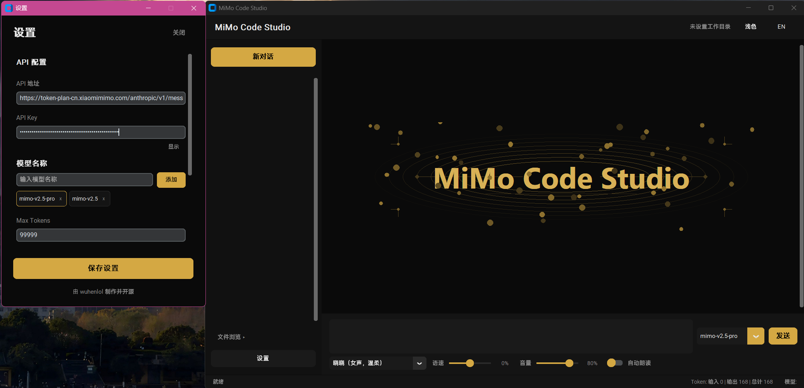
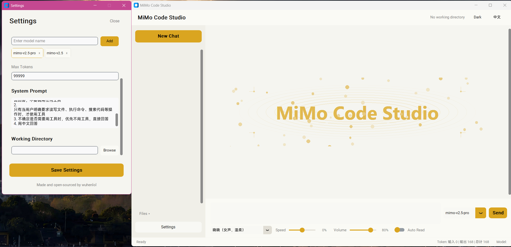
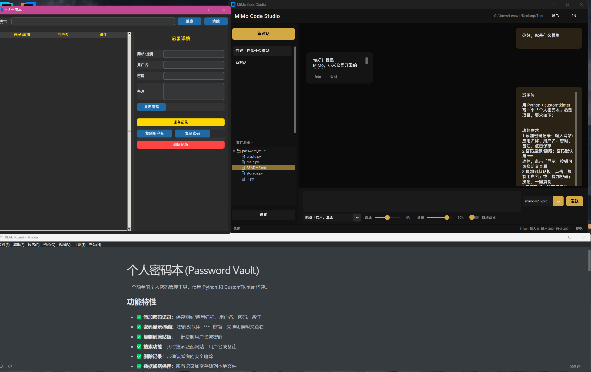

# MiMo Code Studio V2.0

> An AI programming assistant desktop client powered by Xiaomi MiMo model, with code generation, file operations, voice synthesis, and multi-model support.

## Features

1. **AI Chat** — Multi-turn conversations, thinking mode, continuous context
2. **Tool Calls** — File creation/read/write, directory browsing, command execution, code search
3. **Multi-Model Management** — Custom model add/remove, supports mimo-v2.5-pro, mimo-v2.5, etc.
4. **Working Directory** — Project directory setting, real-time file tree preview with unlimited nesting
5. **Voice Synthesis** — edge-tts engine, 13 Chinese/English voices, adjustable speed/volume
6. **Bilingual UI** — Full Chinese/English interface support
7. **Dark/Light Theme** — Seamless theme switching
8. **Chat Management** — Create/switch/delete conversations, persistent history
9. **System Prompt** — Customizable system prompt to control AI behavior
10. **Logo Animation** — Premium visual effects with floating particles and breathing glow

## Screenshots

| Dark Theme | Light Theme | Showcase |
|:---:|:---:|:---:|
|  |  |  |

## Quick Start

### Requirements

- Python 3.10+
- Windows / macOS / Linux

### Install Dependencies

```bash
pip install -r requirements.txt
```

### Configure API

1. Launch the app, click **Settings** at the bottom left
2. Enter your MiMo API endpoint and API Key
3. Add the model names you want to use (e.g. `mimo-v2.5-pro`)
4. Click **Save Settings**

### Launch

```bash
python main.py
```

Or double-click `start.bat` (Windows, no console window).

## Project Structure

```
MiMo-Code-Studio/
├── main.py                 # Entry point
├── api_client.py           # MiMo API client (streaming + tool calls)
├── tts_engine.py           # Voice synthesis engine (edge-tts)
├── audio_player.py         # Audio player (pygame)
├── config.py               # Configuration management
├── tools.py                # Tool implementations (file ops, commands, search)
├── start.bat               # Windows launch script
├── requirements.txt        # Python dependencies
├── ui/
│   ├── app.py              # Main window
│   ├── chat_area.py        # Chat area + GlowLogo animation
│   ├── sidebar.py          # Sidebar (chat list + file tree)
│   ├── input_bar.py        # Input bar (voice control + model selection)
│   ├── settings_panel.py   # Settings panel
│   ├── widgets.py          # Custom widgets (tool cards, etc.)
│   ├── themes.py           # Theme color definitions
│   └── i18n.py             # Internationalization (Chinese/English)
├── data/                   # User data (auto-created, gitignored)
├── pic/                    # Screenshot assets
└── README_EN.md
```

## Tech Stack

| Technology | Purpose |
|---|---|
| Python 3.10+ | Main language |
| customtkinter | Modern GUI framework |
| edge-tts | Microsoft voice synthesis |
| pygame | Audio playback |
| requests | HTTP requests |
| chardet | File encoding detection |

## Acknowledgements

- [Xiaomi MiMo Team](https://github.com/XiaomiMiMo) — MiMo LLM Token Provider
- Claude — Coding Assistant
- [customtkinter](https://github.com/TomSchimansky/CustomTkinter) — Modern Tkinter UI
- [edge-tts](https://github.com/rany2/edge-tts) — Microsoft voice synthesis
- wuhenlol — Developer
